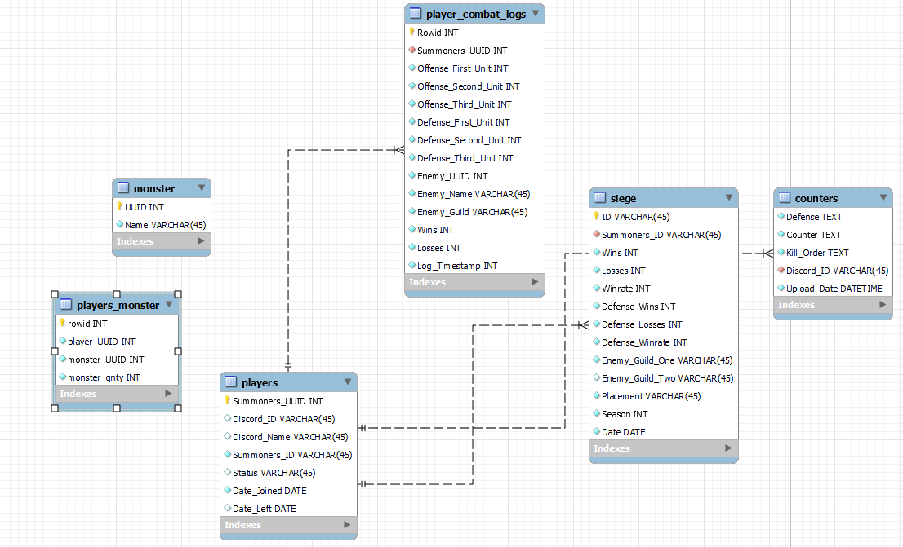

# Discord Data Bot

Discord Data Bot is a tool used to analyze thousands of pieces of data and return organized data specified by the user

### Project Description

* Grabs data from a third party tool in json format, then organize data to user specifications
* Copies file location of json and moves it to a new directory
* Stores data onto MySQL for later access using mysql connector, and viewing on Discord with tabulate formating
* Writes data onto Excel, using openpyxl, for other users to download through Discord

### Available Commands

* stats: Displays current winrate and remaining attacks for each team
* match: Displays winrate of members from highest to lowest wins
* record: Uploads an Excel sheet of all the matches in this season
* completed: Records the match onto an Excel sheet
* add": Adds units onto the MySQL database
* counter": Displays the units from the MySQL database
* tick": Computes input with preset formula 
* register": Adds users to the MySQL database
* player": Displays player history of matches
* player_vs": Displays player history of matches versus specified team
* player_season": Displays player history of matches in a given season
* 
#### Stats Command

#### Match Command

#### Register Commamnd

#### Player Command

#### MySQL ER Diagram

### Thoughts

The decision to make this Data Bot accessible through discord is for a community of players to use the Bot with ease of access, as well as having the ability to converse through discord voice chatting system, while using the Data Bot to help them identify issues in their play styles, or to highlight areas of improvement.

The Bot is currently only available to a closed but growing community currently, with a suggestions text channel for other users to express what features would help them improve, or if there are bugs that need to be fixed. 

